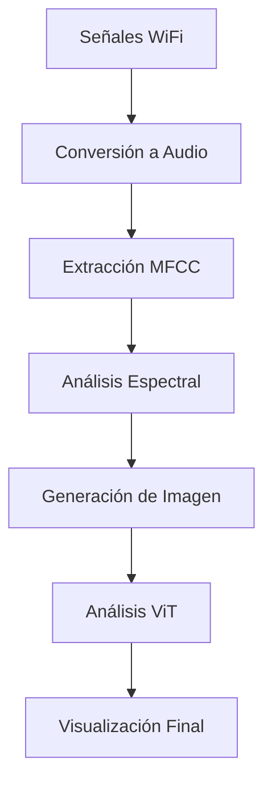
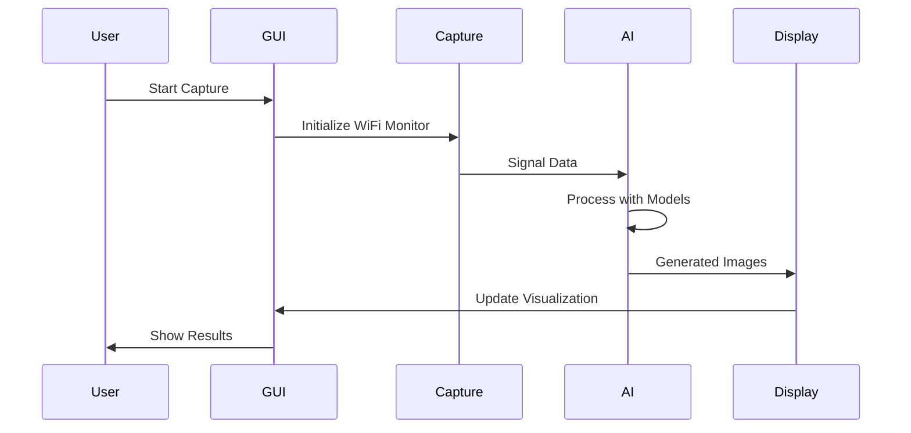

# WiFi Vision Pro 🔄📡🤖

**Advanced Cross-Platform WiFi Signal Visualization with AI Integration**

*Convierte las variaciones de señales WiFi en imágenes visuales utilizando modelos de IA de última generación*

---

## 🌟 Características Principales

### 🔄 Captura en Tiempo Real
- **Monitoreo continuo** de señales WiFi en 2.4GHz, 5GHz y 6GHz
- **Detección automática** de redes y puntos de acceso
- **Análisis de interferencia** y calidad de señal
- **Soporte multiplataforma** (Windows, Linux, macOS)

### 🎨 Visualización Avanzada
- **Conversión señal-a-imagen** usando algoritmos de IA
- **Mapas de calor** en tiempo real de intensidad de señal
- **Patrones de interferencia** visualizados
- **Análisis espectral** y temporal
- **Zoom y navegación** interactiva

### 🤖 Integración con IA
- **Modelos Hugging Face** para procesamiento avanzado
- **Vision Transformer (ViT)** para análisis de imágenes
- **Stable Diffusion** para generación de visualizaciones
- **Procesamiento de audio** desde señales RF
- **Análisis predictivo** de patrones

### 📊 Análisis Profundo
- **Estadísticas en tiempo real** de redes detectadas
- **Distribución de frecuencias** por banda
- **Detección de interferencia** automática
- **Análisis de calidad** de conexión
- **Exportación de datos** y reportes

---

## 🚀 Instalación Rápida

### Windows
```bash
# Descargar el instalador
wget https://github.com/wifi-analysis/wifi-vision-pro/releases/download/v2.0.0/WiFi_Vision_Pro_v2.0.0_Windows_Installer.exe

# Ejecutar como administrador
WiFi_Vision_Pro_v2.0.0_Windows_Installer.exe
```

### Linux (Ubuntu/Debian)
```bash
# Instalar dependencias
sudo apt update
sudo apt install python3-pip python3-dev libqt5widgets5

# Instalar el paquete
wget https://github.com/wifi-analysis/wifi-vision-pro/releases/download/v2.0.0/wifi-vision-pro_2.0.0_amd64.deb
sudo dpkg -i wifi-vision-pro_2.0.0_amd64.deb
```

### macOS
```bash
# Descargar DMG
curl -L -O https://github.com/wifi-analysis/wifi-vision-pro/releases/download/v2.0.0/WiFi_Vision_Pro_v2.0.0_macOS.dmg

# Montar y instalar
hdiutil attach WiFi_Vision_Pro_v2.0.0_macOS.dmg
```

---

## 🛠️ Instalación desde Código Fuente

### Requisitos Previos
- **Python 3.8+**
- **Qt5/Qt6** (PySide6 recomendado)
- **CUDA** (opcional, para aceleración GPU)
- **4GB RAM** mínimo, 8GB recomendado
- **Adaptador WiFi** compatible

### Instalación Paso a Paso

1. **Clonar el repositorio:**
```bash
git clone https://github.com/wifi-analysis/wifi-vision-pro.git
cd wifi-vision-pro
```

2. **Crear entorno virtual:**
```bash
python -m venv wifi_vision_env
source wifi_vision_env/bin/activate  # Linux/macOS
# o
wifi_vision_env\Scripts\activate     # Windows
```

3. **Instalar dependencias:**
```bash
pip install -r requirements.txt
```

4. **Instalar modelos de IA (opcional):**
```bash
# Los modelos se descargan automáticamente en el primer uso
# Para descargar manualmente:
python -c "from transformers import ViTModel; ViTModel.from_pretrained('google/vit-base-patch16-224')"
```

5. **Ejecutar la aplicación:**
```bash
python advanced_gui.py
```

---

## 🎯 Uso de la Aplicación

### Interfaz Principal
```
┌─────────────────────────────────────────────────────────────────┐
│ [▶ Start] [⏹ Stop] [🤖 AI] │ Interface: [Auto ▼]               │
├─────────────────────────────────────────────────────────────────┤
│                                │                                │
│     Visualización en           │     Panel de Análisis          │
│     Tiempo Real                │                                │
│                                │  📊 Estadísticas               │
│  🎨 Mapas de calor            │  🤖 Análisis IA                │
│  📈 Espectrogramas            │  🌐 Redes Detectadas          │
│  🔄 Patrones RF               │  📈 Gráficos                   │
│                                │                                │
└─────────────────────────────────────────────────────────────────┘
```

### Flujo de Trabajo Típico

1. **Iniciar Captura:**
   - Seleccionar interfaz de red
   - Hacer clic en "▶ Start Capture"
   - Observar detección automática de redes

2. **Visualización:**
   - Las señales aparecen como mapas de calor
   - Colores indican intensidad de señal
   - Patrones muestran interferencia

3. **Análisis con IA:**
   - Hacer clic en "🤖 AI Analysis"
   - Esperar procesamiento (10-30 segundos)
   - Revisar resultados en panel derecho

4. **Exportación:**
   - Guardar imágenes generadas
   - Exportar datos de sesión
   - Crear reportes automáticos

---

## 🧠 Algoritmos de IA Integrados

### Modelos Utilizados

#### 1. **Vision Transformer (ViT)**
- **Propósito:** Análisis de patrones visuales en mapas de calor
- **Modelo:** `google/vit-base-patch16-224`
- **Función:** Clasificación de tipos de interferencia

#### 2. **Stable Diffusion**
- **Propósito:** Generación de visualizaciones artísticas
- **Modelo:** `runwayml/stable-diffusion-v1-5`
- **Función:** Conversión texto-a-imagen de patrones RF

#### 3. **Audio Transformer (AST)**
- **Propósito:** Análisis espectral de señales convertidas
- **Modelo:** `MIT/ast-finetuned-audioset-10-10-0.4593`
- **Función:** Clasificación de tipos de señal

### Pipeline de Procesamiento



---

## 📡 Análisis Técnico de Señales

### Tipos de Visualización

#### 1. **Mapa de Intensidad de Señal**
```python
# Ejemplo de interpretación
Signal Strength Map:
🔴 Rojo: -30 a -50 dBm (Excelente)
🟠 Naranja: -50 a -70 dBm (Bueno)
🟡 Amarillo: -70 a -80 dBm (Aceptable)
🔵 Azul: -80 a -90 dBm (Débil)
⚫ Negro: < -90 dBm (Muy débil)
```

#### 2. **Análisis de Interferencia**
- **Patrones regulares:** Interferencia de microondas
- **Picos aleatorios:** Dispositivos Bluetooth
- **Bandas continuas:** Congestión de canal

#### 3. **Distribución Espectral**
```
2.4 GHz Band: ████████░░ 80% ocupación
5.0 GHz Band: ██████░░░░ 60% ocupación  
6.0 GHz Band: ███░░░░░░░ 30% ocupación
```

---

## 🔧 Configuración Avanzada

### Parámetros de Captura
```json
{
  "sample_rate": 100,
  "capture_duration": 60,
  "frequency_bins": 256,
  "spatial_resolution": [800, 600],
  "rssi_threshold": -90,
  "noise_floor": -100
}
```

### Optimización de IA
```json
{
  "ai_processing_interval": 10,
  "gpu_acceleration": true,
  "model_precision": "float16",
  "batch_size": 8,
  "inference_steps": 20
}
```

### Filtros de Red
```python
# Configurar filtros personalizados
network_filters = {
    "exclude_ssids": ["hidden", "test"],
    "min_signal_strength": -80,
    "frequency_bands": ["2.4GHz", "5GHz"],
    "channel_range": [1, 14]
}
```

---

## 🏗️ Arquitectura del Sistema

### Componentes Principales

```
├── 📁 wifi_signal_capture.py    # Captura de señales RF
├── 📁 huggingface_integration.py # Modelos de IA
├── 📁 advanced_gui.py           # Interfaz de usuario
├── 📁 main.py                   # Analizador de imágenes
└── 📁 build_installer.py        # Constructor multiplataforma
```

### Flujo de Datos


---

## 📊 Casos de Uso

### 1. **Análisis de Cobertura WiFi**
- Mapear zonas de buena/mala cobertura
- Identificar puntos muertos
- Optimizar posicionamiento de APs

### 2. **Detección de Interferencia**
- Localizar fuentes de interferencia
- Analizar impacto en rendimiento
- Recomendar cambios de canal

### 3. **Investigación de Seguridad**
- Detectar redes ocultas
- Analizar patrones de tráfico
- Identificar dispositivos no autorizados

### 4. **Monitoreo de Espectro**
- Cumplimiento regulatorio
- Análisis de ocupación de banda
- Planificación de frecuencias

---

## 🛡️ Consideraciones de Seguridad

### Permisos Requeridos
- **Windows:** Ejecutar como Administrador
- **Linux:** `sudo` para acceso a interfaces de red
- **macOS:** Permisos de administrador

### Privacidad
- **No se almacenan** datos de tráfico
- **Solo metadatos** de señales RF
- **Procesamiento local** de IA (opcional cloud)

### Ética de Uso
- Usar solo en redes propias o autorizadas
- Cumplir regulaciones locales
- Respetar privacidad de terceros

---

## 🚀 Compilación de Instaladores

### Construcción Automática
```bash
# Instalar dependencias de compilación
pip install pyinstaller auto-py-to-exe

# Generar instalador para plataforma actual
python build_installer.py

# Instaladores generados en /dist/
ls dist/
```

### Compilación Manual por Plataforma

#### Windows
```bash
# Crear ejecutable
pyinstaller --onefile --windowed advanced_gui.py

# Crear instalador NSIS (requiere NSIS instalado)
makensis wifi_vision_pro_installer.nsi
```

#### Linux
```bash
# AppImage
python build_installer.py --target appimage

# Paquete DEB
python build_installer.py --target deb
```

#### macOS
```bash
# Bundle de aplicación
python build_installer.py --target app

# Imagen de disco
python build_installer.py --target dmg
```

---

## 🔬 Desarrollo y Contribución

### Configuración de Desarrollo
```bash
# Clonar y configurar
git clone https://github.com/wifi-analysis/wifi-vision-pro.git
cd wifi-vision-pro

# Instalar dependencias de desarrollo
pip install -e .
pip install pytest black flake8

# Ejecutar pruebas
pytest tests/

# Formatear código
black .
```

### Estructura del Proyecto
```
wifi-vision-pro/
├── 📁 src/                    # Código fuente principal
├── 📁 tests/                  # Pruebas unitarias
├── 📁 models/                 # Modelos de IA locales
├── 📁 docs/                   # Documentación
├── 📁 assets/                 # Iconos y recursos
├── 📁 build/                  # Archivos de compilación
└── 📁 dist/                   # Distribuciones finales
```

### Roadmap de Características
- [ ] Soporte para WiFi 6E/7
- [ ] Análisis predictivo con ML
- [ ] API REST para integración
- [ ] Dashboard web complementario
- [ ] Exportación a formatos científicos

---

## 📞 Soporte y Contacto

### Recursos de Ayuda
- **📖 Documentación:** [docs.wifivision.pro](https://docs.wifivision.pro)
- **💬 Foro de Comunidad:** [forum.wifivision.pro](https://forum.wifivision.pro)
- **🐛 Reportar Bugs:** [GitHub Issues](https://github.com/wifi-analysis/wifi-vision-pro/issues)

### Contacto Comercial
- **📧 Email:** support@wifivisionpro.com
- **🌐 Website:** [wifivisionpro.com](https://wifivisionpro.com)
- **📞 Teléfono:** +1-555-WIFI-PRO

### Licencia y Créditos
```
MIT License - WiFi Vision Pro
Copyright (c) 2025 WiFi Analysis Solutions

Modelos de IA proporcionados por Hugging Face
Iconos por Material Design Icons
```

---

## 🏆 Reconocimientos

**WiFi Vision Pro** ha sido desarrollado utilizando tecnologías de vanguardia:

- 🤖 **Hugging Face Transformers** - Modelos de IA
- 🎨 **Qt/PySide6** - Interfaz de usuario
- 📊 **OpenCV** - Procesamiento de imágenes
- 🔊 **Librosa** - Análisis de audio
- 🌊 **Scapy** - Captura de paquetes
- ⚡ **PyTorch** - Framework de ML

*"Revolucionando la visualización de señales WiFi con inteligencia artificial"*

---

**⚡ WiFi Vision Pro v2.0.0 - Donde las ondas de radio se convierten en arte visual** ⚡